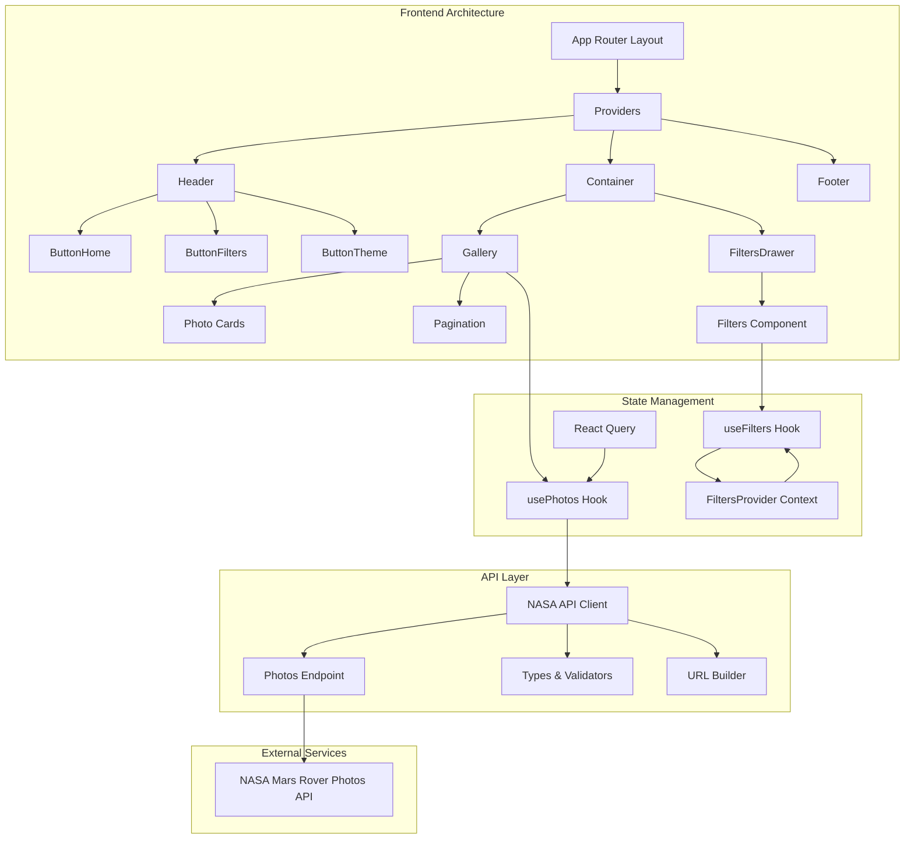
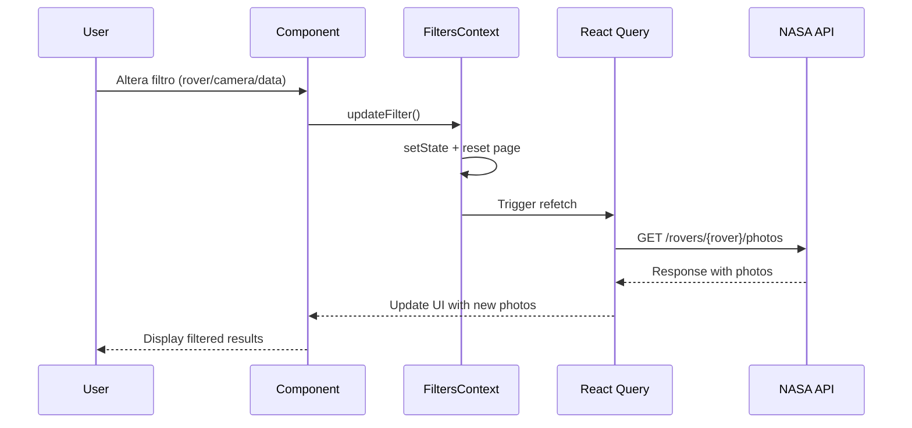

# 🚀 UniverseEx - Mars Rover Photos Explorer

Um aplicativo web moderno para explorar fotos dos rovers de Marte da NASA,
construído com Next.js 15, React 19, TypeScript e Tailwind CSS.

## 📋 Sobre o Projeto

O **UniverseEx** permite aos usuários navegar e filtrar fotografias capturadas
pelos rovers da NASA em Marte (Curiosity, Spirit, Opportunity). O projeto
utiliza a API oficial da NASA para buscar imagens em tempo real, oferecendo uma
experiência rica e responsiva.

### ✨ Funcionalidades

- 🔍 **Filtros Avançados**: Rover, câmera, data terrestre
- 🌙 **Dark/Light Mode**: Toggle de tema com persistência
- 📱 **Design Responsivo**: Otimizado para mobile, tablet e desktop
- ⚡ **Performance**: Cache inteligente com React Query
- 🎨 **UI Moderna**: Interface clean com Tailwind CSS
- ♿ **Acessibilidade**: Componentes semânticos e ARIA labels

## 🛠️ Tecnologias Utilizadas

- **Framework**: Next.js 15 (App Router)
- **Linguagem**: TypeScript
- **Estilização**: Tailwind CSS v4
- **State Management**: React Query (TanStack Query)
- **Ícones**: Heroicons (SVG inline)
- **API**: NASA Mars Rover Photos API

## 📐 Arquitetura do Projeto



## 🏗️ Estrutura de Diretórios

```
src/
├── app/                    # App Router (Next.js 15)
│   ├── layout.tsx         # Layout principal
│   ├── page.tsx           # Página inicial
│   ├── providers.tsx      # React Query Provider
│   └── globals.css        # Estilos globais
├── components/            # Componentes reutilizáveis
│   ├── ButtonHome/        # Botão home + reset filtros
│   ├── ButtonTheme/       # Toggle dark/light mode
│   ├── Container/         # Layout container
│   ├── Filters/           # Formulário de filtros
│   ├── FiltersDrawer/     # Modal lateral de filtros
│   ├── Footer/            # Rodapé
│   ├── Gallery/           # Grid de fotos
│   ├── Header/            # Cabeçalho
│   └── Pagination/        # Controles de paginação
├── context/               # Context API
│   └── FiltersProvider.tsx # Estado global dos filtros
├── hooks/                 # Custom hooks
│   └── usePhotos.ts       # Hook para buscar fotos
└── lib/
    └── api/
        └── nasa/          # Cliente da API NASA
            ├── types.ts   # Tipos TypeScript
            ├── constants.ts # Constantes
            ├── url.ts     # Construtor de URLs
            └── index.ts   # Exports centralizados
```

## 🔄 Fluxo de Dados



## 🚀 Como Executar

### Pré-requisitos

- Node.js 18+
- npm ou yarn

### Instalação

1. **Clone o repositório**

```bash
git clone https://github.com/igoralvesa/desafio-valcann-frontend.git
cd desafio-valcann-frontend
```

2. **Instale as dependências**

```bash
npm install
```

3. **Configure as variáveis de ambiente**

```bash
# Crie o arquivo .env.local
NEXT_PUBLIC_NASA_KEY=sua_chave_da_api_nasa
```

4. **Execute o projeto**

```bash
npm run dev
```

5. **Acesse no navegador**

```
http://localhost:3000
```

### Scripts Disponíveis

```bash
npm run dev          # Servidor de desenvolvimento
npm run build        # Build para produção
npm run start        # Servidor de produção
npm run lint         # Verificação de código
```

## 🌟 Funcionalidades Detalhadas

### 🔍 Sistema de Filtros

- **Rover**: Curiosity, Spirit, Opportunity
- **Câmera**: Filtro dinâmico baseado no rover selecionado
- **Data**: Seletor de data terrestre
- **Reset**: Botão home restaura filtros padrão

### 🎨 Tema Dinâmico

- **Toggle manual**: Botão sun/moon no header
- **Persistência**: Mantém preferência entre sessões
- **Sistema**: Detecta preferência do OS automaticamente

### 📱 Responsividade

- **Mobile**: 1 coluna, navegação touch-friendly
- **Tablet**: 2 colunas, layout otimizado
- **Desktop**: 3 colunas, experiência completa

## 🧪 Decisões Técnicas

### **Context API vs Redux**

Optei por Context API devido à simplicidade do estado (filtros) e ao tamanho do
projeto.

### **React Query**

Escolhido para cache inteligente, loading states e error handling automático.

### **Tailwind CSS v4**

Versão mais recente com melhor performance e DX (Developer Experience).

### **TypeScript Strict**

Configuração rigorosa para máxima segurança de tipos.

## 📊 Performance

- **Lazy Loading**: Imagens carregadas sob demanda
- **Caching**: React Query mantém dados em cache
- **Code Splitting**: Componentes divididos automaticamente
- **Otimização**: Imagens otimizadas pelo Next.js

## 🔧 Próximas Melhorias

- [ ] Infinite scroll para paginação
- [ ] Favoritos com localStorage
- [ ] Compartilhamento de fotos
- [ ] Busca por texto/descrição
- [ ] PWA (Progressive Web App)
- [ ] Testes unitários e E2E

## 📄 Licença

Este projeto está sob a licença MIT. Veja o arquivo [LICENSE](LICENSE) para mais
detalhes.

## 👨‍💻 Autor

**Igor Alves Almeida**

- GitHub: [@igoralvesa](https://github.com/igoralvesa)
- LinkedIn: [Igor Alves](https://linkedin.com/in/igoralvesa)

---

## 🙏 Agradecimentos

- **NASA** pela API pública e dados incríveis
- **Vercel** pelo Next.js e hospedagem
- **Tailwind Labs** pelo framework CSS
- **Heroicons** pelos ícones SVG

---

_Feito com ❤️ para explorar o universo de Marte_
